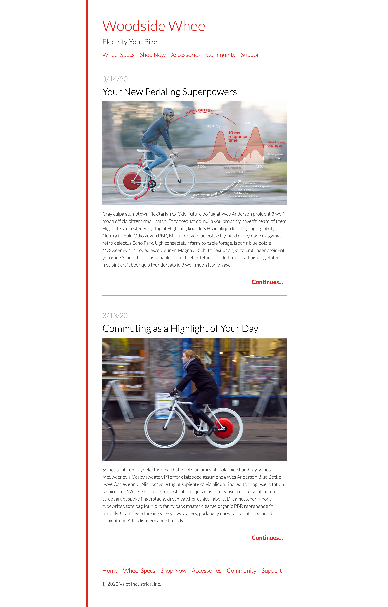

# HTML / CSS Lab

In this lab you will practice converting a design into HTML and CSS

The design is included in `design.png`.

Convert the design into HTML in the `index.html` file, and then write the CSS in `main.css`.

We'll provide some style information below. You can approximate spacing.

Content for the page can be found in copy.txt.

Links do not need to go anywhere.

CSS Property Almanac: https://css-tricks.com/almanac/

The Box Model: https://css-tricks.com/the-css-box-model/

HTML Elements Reference: https://developer.mozilla.org/en-US/docs/Web/HTML/Element

## Provided style information

#### I have already set these styles on 'body' to get the page started:

  - High-level text properties
  - "Lato" font
  - 1.5 line-height
  - max-width 720px
  - 54px of padding
  - solid border on the left 6px wide with a color of #e2231a

#### YOU DO:
  Links (and other red colored text)
  color #e2231a

  Headings:
  font-weight: 100

  Date:
  color #cccccc

  Article Title
  color black

  HINT: you can make the images fit nicely inside their parent elements by setting `width: 100%`

  HINT 2: to right align "continues" it may be easiest for now to make that element a heading and use `text-align: right`

  Bonus (DO AFTER ALL ELSE COMPLETE): look up how to do element hover styles

  Links hover color: #aa0000

## Design

